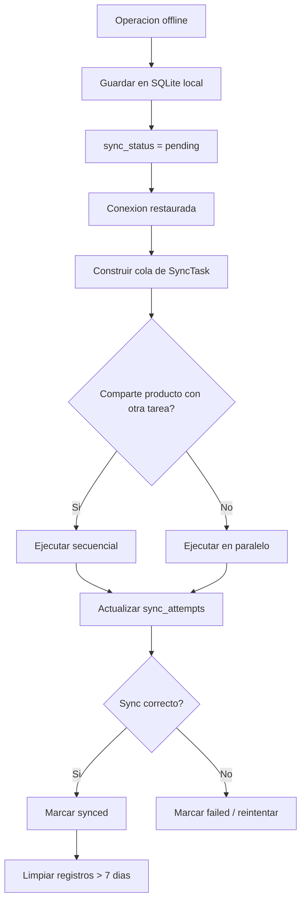

# Flujo de sincronizacion offline

## Reglas

- Si no hay internet, ventas y compras se guardan localmente con `pending`.
- Al recuperar conexion, se ejecuta la cola.
- Operaciones del mismo producto se sincronizan en secuencia.
- Operaciones de productos diferentes pueden viajar en paralelo.
- Si el envio falla, se incrementa `sync_attempts`.
- Si supera el limite operativo definido por negocio, se debe alertar en UI y log.

## Motor actual

Referencia:

- `lib/core/sync/sync_engine.dart`

## Pseudocodigo

```text
onConnectivityRestored():
  pending = loadPendingSales() + loadPendingPurchases()
  tasks = map pending -> SyncTask(productIds, execute)

  while tasks not empty:
    batch = []
    lockedProducts = set()

    for task in tasks:
      if task.productIds intersects lockedProducts:
        continue
      batch.add(task)
      lockedProducts.addAll(task.productIds)

    run batch in parallel
    remove batch from tasks

  cleanupSyncedOlderThan(7 days)
```

## Diagrama


